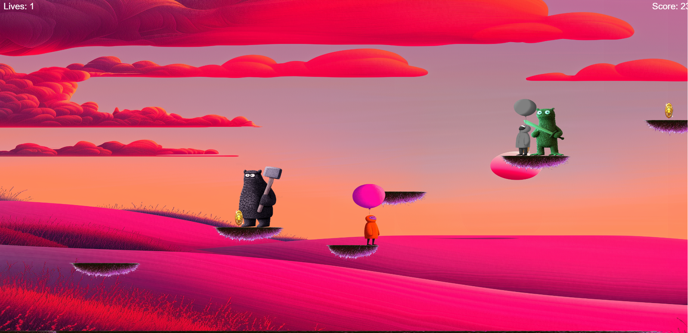

# Balloon Jump

A dynamic platform game where players navigate through challenging levels, collecting coins and power-ups while avoiding enemies.

# [Play Live Demo](https://shaharfullstack.github.io/BalloonGame/)




## Game Overview

Balloon Jump is an HTML5 canvas-based platform game featuring:

- Multiple progressively challenging levels
- Dynamic platforming with moving platforms
- Various enemy types with different movement patterns
- Collectible power-ups (double jump, invincibility)
- Checkpoint system for saving progress
- Score system based on coin collection and enemy defeat

## Controls

- **A** - Move left
- **D** - Move right
- **W** - Jump (press again for double jump when power-up is active)
- **Shift** - Dash (when available)
- **R** - Restart game after game over

## Game Features

### Player Abilities
- **Double Jump**: Allows the player to jump a second time while in mid-air
- **Dash**: Rapid movement burst in the direction of travel
- **Invincibility**: Temporary immunity to enemy damage

### Game Elements
- **Platforms**: Static and moving platforms to traverse
- **Enemies**: Various enemy types with different movement patterns
- **Coins**: Collectibles that increase the player's score
- **Checkpoints**: Save progress within a level
- **Power-ups**: Special items that grant abilities
- **Finish Flag**: Reach to complete the level

## Game Mechanics

- The player has three lives to complete all levels
- Falling off the screen or colliding with enemies reduces lives
- Collecting coins and defeating enemies increases score
- Checkpoints save the player's position if they lose a life
- Power-ups provide temporary abilities
- Completing all levels wins the game

## Technical Implementation

The game is built using:
- HTML5 Canvas for rendering
- JavaScript for game logic and physics
- Asset preloading system for images
- Collision detection system
- Camera system with parallax scrolling effects
- Particle system for visual effects

## Setup and Installation

1. Clone the repository
2. Open `index.html` in a modern web browser
3. No additional dependencies or build steps required

## File Structure

```
/
├── index.html
├── assets/
│   ├── css/
│   │   └── style.css
│   ├── js/
│   │   └── script.js
│   ├── images/
│   │   ├── background2.png
│   │   ├── hero_idle.png
│   │   ├── hero_jump.png
│   │   ├── orc.png
│   │   ├── lizard.png
│   │   ├── enemy.png
│   │   ├── coin.png
│   │   ├── finish.png
│   │   ├── platform.png
│   │   ├── doublejump.png
│   │   ├── checkpoint.png
│   │   ├── checkpoint_activated.png
│   │   └── invincibility.png
│   └── favicon.ico
```

## Future Enhancements

- Additional levels with unique challenges
- New power-ups and enemy types
- Mobile touch controls
- Sound effects and background music
- High score system

## Credits

Game and character design by Shahar Maoz.

---
# [Play Live Demo](https://shaharfullstack.github.io/BalloonGame/)

© 2025 Shahar Maoz. All rights reserved.
